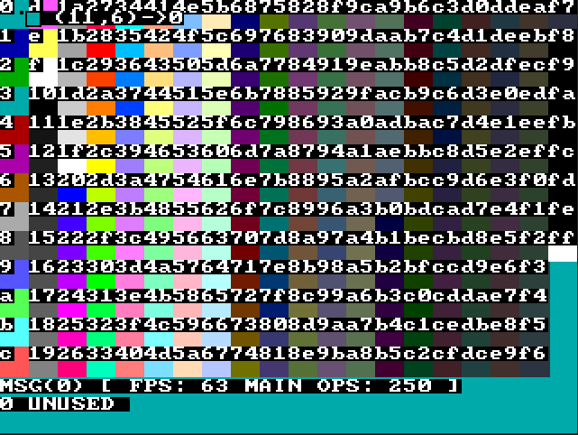
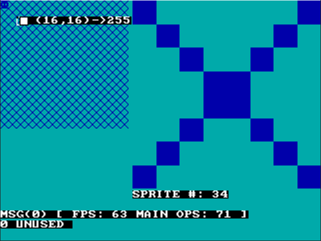
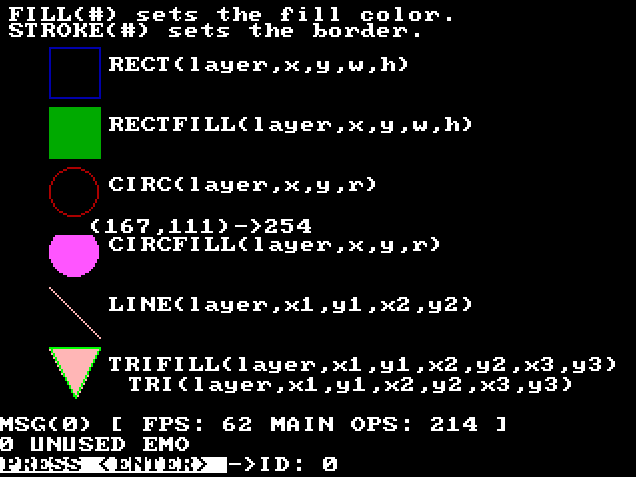
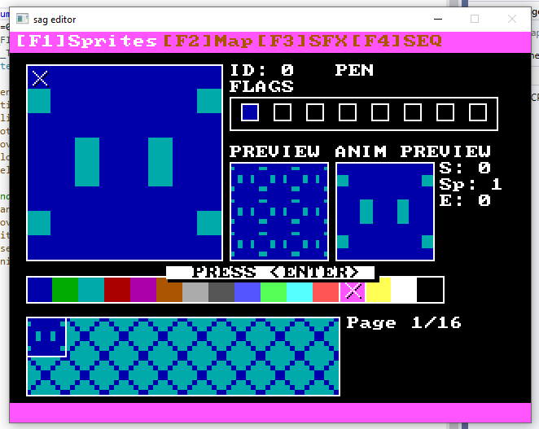
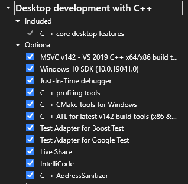
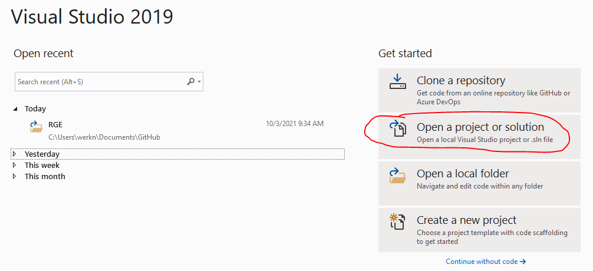
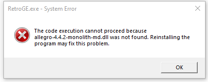
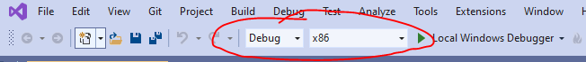

# RGE
RGE (RetroGE / Retro Game Engine) is a hobbyist engine running on 16 and 32-bit operating systems with the goal of eventually cross-compiling to the Nintendo 64.

It's primarily aimed at allowing me to learn C while also making a game prototyping tool.  I tinker on it during lunch or coffee breaks so its a slow process.

>NOTE:  This engine is still in very early development.

## Features:
 - Scene Management
 - Basic UI System
 - Easy to use API that mimics functionality from PICO-8 and TIC-80
 - VRAM/UI Debugger
 - Built-in Sprite Editor, Map Editor, Audio Sequencer, and SFX Generator
 - Support for GameBoy graphic formats (2BPP, 3BPP and 4BPP)
 - Maximum of 256 sprites (or a 128px x 128px spritesheet), bit flag setting similar to PICO-8 

## Demos:
Basic demos illustrating the engines use (currently) can be found under `./RetroGE/Demos`.

## Debug Menu
To access the debug menu press `~` while the engine is running.  This will allow you to debug the currently loaded VGA palette, VRAM, UI, Framerate and Debug message queue.

Press `Home` to cycle to the next debug menu, `PgDn/PgUp` to cycle debug messages and lastly `~` to dismiss the menu and return to current scene.

| Mode  | Screenshot  | Description |
|---|---|---|
| Palette |    | Debug VGA palettes, and determine color indexes |  
| VRAM |    | Debug VRAM, assigned sprite palette, and sprite index | 
| UI |    | Debug UI elements | 
| EDITOR |    | Edit in memory graphics, sound and map data (In-progress) | 
---

## Setup Visual Studio 2019

I typically develop this project under Windows XP using Visual Studio Community Edition 2010 as the engine is primarily meant to run on this platform due to compatibility with my Nintendo 64 development tools.  However, the project is still usable under Visual Studio 2019 and can be setup under Windows 10.  To do this perform the following:

1.  Download and Install Visual Studio 2019 from here: [https://visualstudio.microsoft.com/](https://visualstudio.microsoft.com/).  Be sure to install `Desktop development with C++`.  This should be all you need (outside of VC++ 2010 runtime).  Here's a screenshot of my installation in case something appears to be missing:

2.  Next, because were using Allegro 4.4 which is a very very old game library we need to install VC++ 2010 runtime.  Download and install `vcredist_x86.exe` and `vcredist_x64.exe` from [https://www.microsoft.com/en-us/download/confirmation.aspx?id=26999](https://www.microsoft.com/en-us/download/confirmation.aspx?id=26999).

3.  Launch Visual Studio and select `Open a project or solution`.

4.  Next, from the root of this project run `setup_dll.bat`.  This will add `allegro-4.4.2-monolith-md.dll` to each Debug folder.  If you forget this step and go to run the project you'll see something like this: 

5.  Make sure to configure the build to be Debug and x86, similar to what is shown below:

6.  Lastly, click `Local Windows Debugger` and the following should launch:

